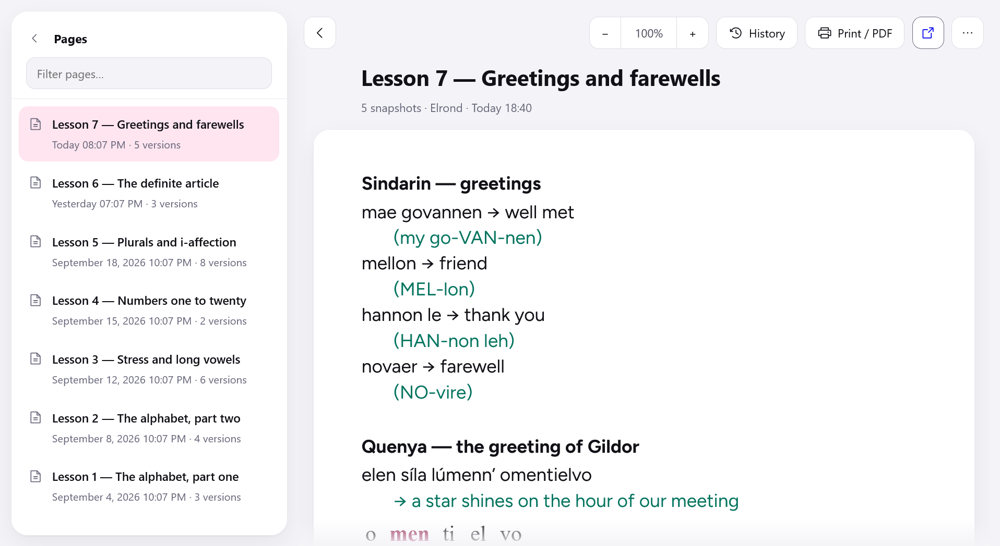
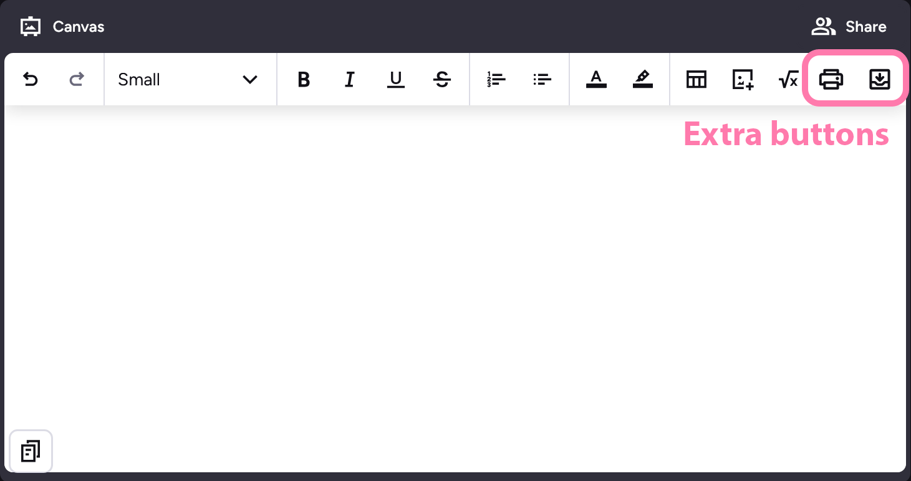

# Preply Canvas Archiver

Saves the Canvas pages of your Preply lessons and lets you read them back
whenever you want — including outside class hours, when Preply no longer opens
them.

Unofficial tool, not affiliated with Preply.

> **Status: pre-release.** Not yet published to addons.mozilla.org or the
> Chrome Web Store.
>
> Project page: <https://mars073.github.io/Preply-canvas-archiver/>





## What it does

- Adds an **archive button** to the Canvas toolbar during a lesson. One click
  stores the page; it also saves on its own a minute after the last edit.
- Keeps **every version** of a page, and shows what changed between two of them.
- Reads your archive **offline**, from a viewer that never contacts Preply.
- **Prints to PDF** and exports a self-contained HTML file.
- Search across a classroom's pages, accent- and case-insensitive.
- Available in English, French, Spanish, Russian, Polish and Chinese.

## Privacy

Everything stays in your browser. The extension has no server, sends no
telemetry, and transmits nothing anywhere. It reads `preply.com` pages while you
are on them, and writes to your browser's local storage. See
[PRIVACY.md](PRIVACY.md).

## Install

Store listings are not live yet.

To run it from source meanwhile:

```sh
bash tools/package.sh
```

- **Firefox** — `about:debugging` → *This Firefox* → *Load Temporary Add-on* →
  pick `src/manifest.json`. Removed when Firefox restarts.
- **Chrome** — `chrome://extensions` → enable *Developer mode* → *Load unpacked*
  → pick `dist/chrome/`.

## Usage

1. Open a lesson and its Canvas.
2. Click the archive button on the right of the Canvas toolbar.
3. Open the archive any time from the extension's toolbar icon.

Only pages you visit while the extension is active can be captured; there is no
way to fetch past lessons retroactively.

## Development

No toolchain, no dependencies, no build step for the code: plain DOM, plain CSS,
plain JavaScript. Two scripts exist, both optional:

| Command | Purpose |
|---|---|
| `bash tools/package.sh` | build `dist/firefox` and `dist/chrome`, plus their zips |
| `bash tools/build-icons.sh` | regenerate `src/icons.js` from `assets/phosphor/*.svg` |

`jsconfig.json` turns on `checkJs`, so an editor type-checks the JSDoc without
anything being installed.

Contributors: read [CLAUDE.md](CLAUDE.md) for the working rules, then
[context.md](context.md) for the architecture and the reasoning behind it.

## Third-party assets

Icons come from [Phosphor Icons](https://phosphoricons.com), MIT licensed, and
their path data ships inside the extension. The viewer renders archived pages in
[Figtree](https://fonts.google.com/specimen/Figtree), bundled as woff2 under the
SIL Open Font License. Full notices in [THIRD-PARTY.md](THIRD-PARTY.md).

## Thanks

To **Paula**, my Polish tutor and a formidable authority on sękacz, whose
lessons are the reason this exists at all.

To **Shuang laoshi**, my Chinese tutor, for the same reason in another script.

This tool was written to keep what the two of them teach me.

## Licence

[Mozilla Public License 2.0](LICENSE).

File-level copyleft: these files may be used inside a larger work of any kind,
but changes made *to them* have to be published under the same licence. Each
source file carries the notice; the licence text ships inside every package.
